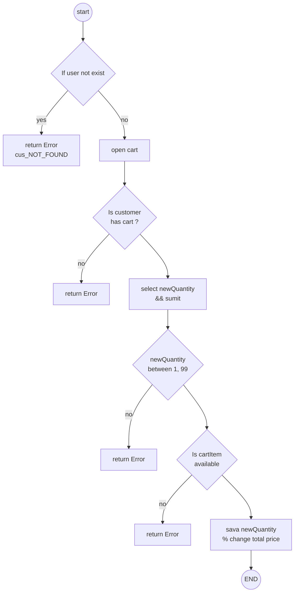
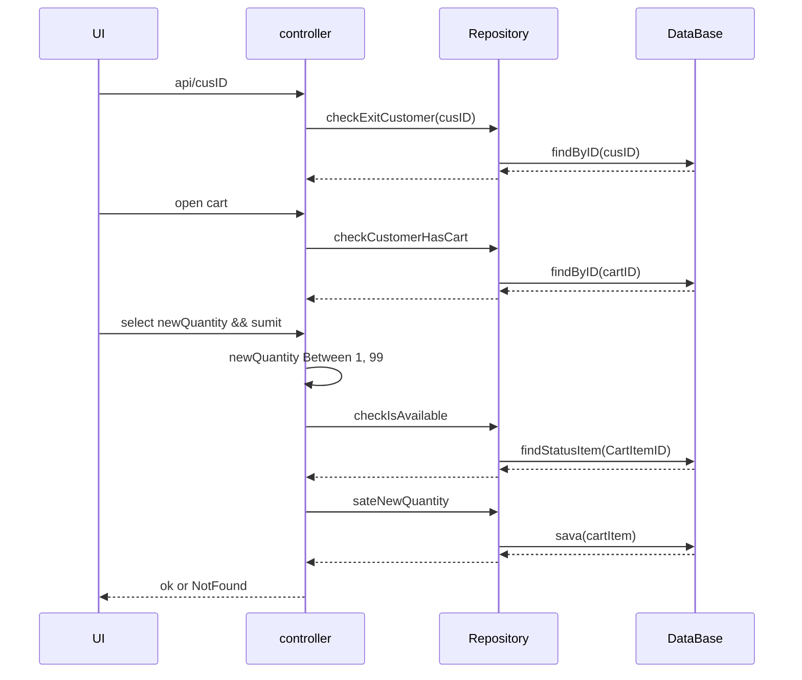

# food_delivery_api
for java eats project in mentorship

# Cart management api
## update quantity   

###flow chart update

### sequence diagram updateQuantity



### Request Body updateQuantity


### pseodu code  updateQuantity 
```text
START

    Is user exist?

    IF user does not exist
        RETURN Error
    END IF

    Is user has cart?

    IF user does not have cart
        RETURN Error

    // update  quantity

    If newQuantity is  unavailable in menu
        not change quantity
    END IF

    IF newQuantity > 1 && newQuantity < 99
        update quantity
        Change total price
    END use

    sava change in Db
```

