# Cart Management API

Production-oriented cart management module for a Spring Boot food-delivery application.

This document describes the current **Cart** and **Cart Item** REST API, including endpoint contracts, request/response behavior, validation rules, sequence diagrams, flowcharts, and service-level pseudocode.

> **Current authentication status**
>
> Authentication is not implemented yet, so `customerId` is explicitly provided in the URL.
>
> After authentication is introduced, the recommended public API is to remove `customerId` from the path and resolve it from the authenticated principal/JWT.

---

## Table of Contents

- [Architecture Overview](#architecture-overview)
- [API Conventions](#api-conventions)
- [Endpoint Collection](#endpoint-collection)
- [Data Contracts](#data-contracts)
- [1. Get Cart](#1-get-cart)
- [2. Add Item to Cart](#2-add-item-to-cart)
- [3. Update Cart Item Quantity](#3-update-cart-item-quantity)
- [4. Remove Single Cart Item](#4-remove-single-cart-item)
- [5. Batch Remove Cart Items](#5-batch-remove-cart-items)
- [6. Clear Cart](#6-clear-cart)
- [Validation and Error Handling](#validation-and-error-handling)
- [Persistence Notes](#persistence-notes)
- [Future Authentication Refactor](#future-authentication-refactor)

---

# Architecture Overview

The cart module is modeled around `Cart` as the main business resource and `CartItem` as a child resource.

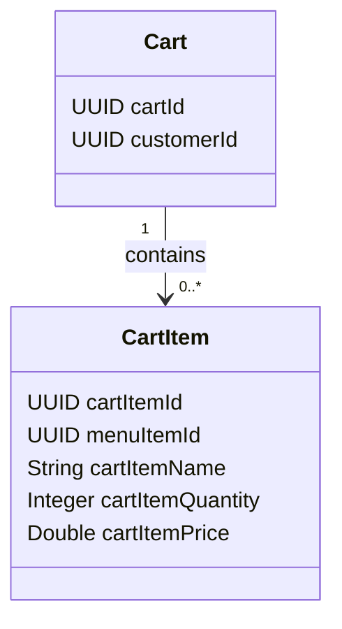

Recommended Spring Boot responsibility split:

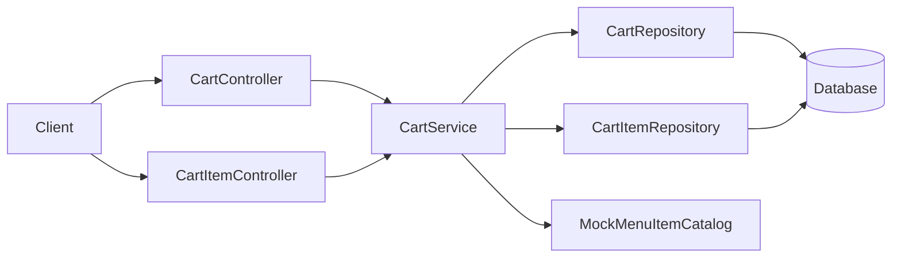

### Controller responsibilities

- `CartController`
    - Get the whole cart.
    - Clear the whole cart.

- `CartItemController`
    - Add an item.
    - Update item quantity.
    - Remove one item.
    - Batch remove items.

### Service responsibility

`CartService` owns cart business operations.

Separating controllers does **not** require creating a separate `CartItemService`. `CartItem` is still conceptually part of the `Cart` aggregate.

---

# API Conventions

Base path:

```text
/api/v1
```

Current customer-scoped cart path:

```text
/api/v1/customers/{customerId}/cart
```

General rules used by this API:

1. Resource identity belongs in the URL.
2. Operation data belongs in the request body.
3. Price is authoritative on the server and must not be trusted from the client.
4. `cartItemId` is generated by the backend.
5. Quantity must always be greater than zero.
6. Quantity `0` does not mean delete. Item removal uses a delete operation.
7. Ownership is enforced by combining `customerId` with the requested cart/cart-item operation.
8. Bulk deletes are implemented as one database bulk operation, not one SQL statement per item.

---

# Endpoint Collection

| Feature | HTTP | Endpoint | Body | Success |
|---|---|---|---|---|
| Get cart | `GET` | `/api/v1/customers/{customerId}/cart` | None | `200 OK` |
| Add item | `POST` | `/api/v1/customers/{customerId}/cart/items` | `AddToCartRequestDto` | `200 OK` |
| Update quantity | `PATCH` | `/api/v1/customers/{customerId}/cart/items/{cartItemId}` | `UpdateCartItemQuantityRequest` | `200 OK` |
| Remove one item | `DELETE` | `/api/v1/customers/{customerId}/cart/items/{cartItemId}` | None | `204 No Content` |
| Batch remove items | `POST` | `/api/v1/customers/{customerId}/cart/items/batch-delete` | `RemoveCartItemsRequest` | `204 No Content` |
| Clear cart | `DELETE` | `/api/v1/customers/{customerId}/cart` | None | `204 No Content` |

> `POST /batch-delete` is intentionally used for arbitrary-size batch requests because a request body on `DELETE` does not have generally defined semantics across HTTP infrastructure.

---

# Data Contracts

## AddToCartRequestDto

```java
public record AddToCartRequestDto(

        @NotNull(message = "Menu item must be selected")
        UUID menuItemId,

        @NotNull(message = "Quantity is required")
        @Positive(message = "Quantity must be greater than zero")
        Integer quantity

) {
}
```

Example:

```json
{
  "menuItemId": "0190f001-1111-7000-8000-000000000001",
  "quantity": 2
}
```

---

## UpdateCartItemQuantityRequest

```java
public record UpdateCartItemQuantityRequest(

        @NotNull(message = "Quantity is required")
        @Positive(message = "Quantity must be greater than zero")
        Integer quantity

) {
}
```

Example:

```json
{
  "quantity": 4
}
```

---

## RemoveCartItemsRequest

A `Set` is preferred so duplicate IDs are naturally removed.

```java
public record RemoveCartItemsRequest(

        @NotEmpty(message = "At least one cart item must be provided")
        Set<@NotNull UUID> cartItemIds

) {
}
```

Example:

```json
{
  "cartItemIds": [
    "0190f002-1111-7000-8000-000000000001",
    "0190f002-1111-7000-8000-000000000002"
  ]
}
```

---

## CartItemResponseDto

```java
public record CartItemResponseDto(
        UUID cartItemId,
        UUID menuItemId,
        Integer cartItemQuantity,
        Double cartItemPrice
) {
}
```

> For production monetary values, `BigDecimal` is preferred over `Double`.

---

## ErrorResponse

```java
@Builder
public record ErrorResponse(
        String status,
        String message,
        LocalDateTime timestamp
) {
}
```

Example:

```json
{
  "status": "BAD_REQUEST",
  "message": "quantity: Quantity must be greater than zero",
  "timestamp": "2026-08-29T18:30:00"
}
```

---

# 1. Get Cart

## Endpoint

```http
GET /api/v1/customers/{customerId}/cart
```

Returns the customer's current cart and its items.

### Example response

```json
{
  "cartId": "0190f100-1111-7000-8000-000000000001",
  "customerId": "0190f200-1111-7000-8000-000000000001",
  "items": [
    {
      "cartItemId": "0190f300-1111-7000-8000-000000000001",
      "menuItemId": "0190f001-1111-7000-8000-000000000001",
      "cartItemQuantity": 2,
      "cartItemPrice": 120.0
    }
  ]
}
```

## Sequence Diagram

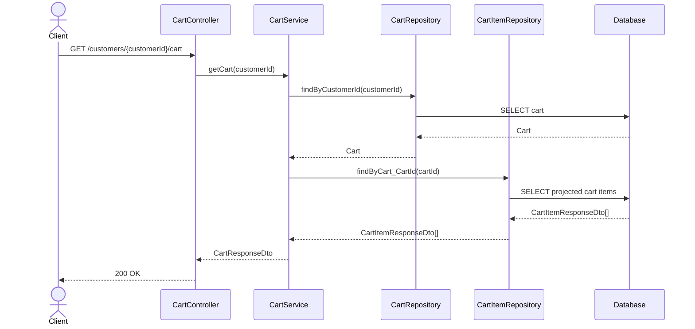

## Flowchart

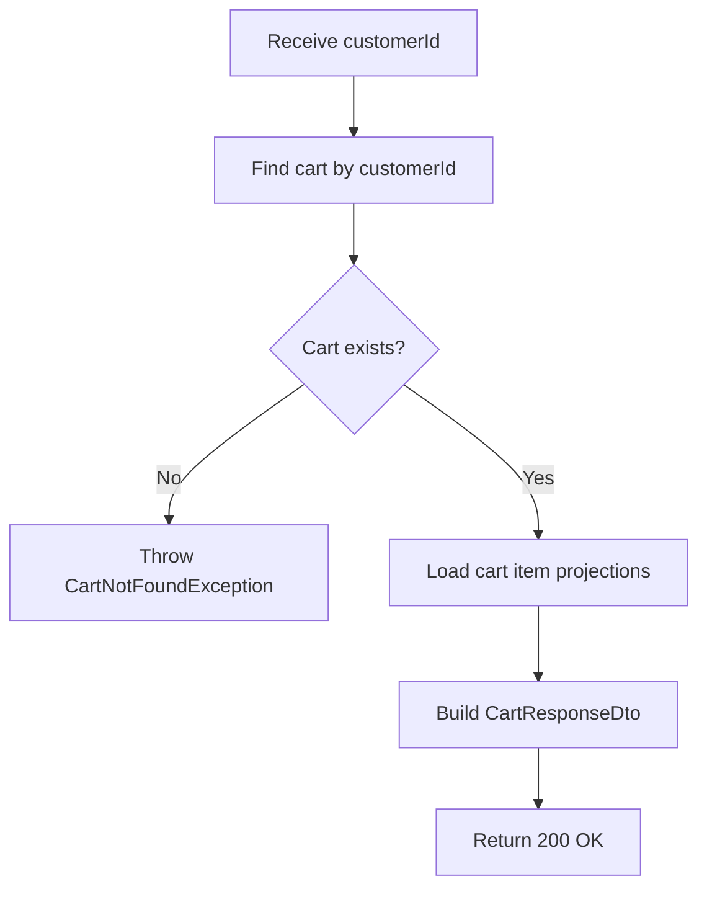

## Pseudocode

```text
FUNCTION getCart(customerId):

    cart = cartRepository.findByCustomerId(customerId)

    IF cart does not exist:
        THROW CartNotFoundException

    items = cartItemRepository.findByCart_CartId(cart.cartId)

    RETURN CartResponseDto(
        cartId = cart.cartId,
        customerId = customerId,
        items = items
    )
```

---

# 2. Add Item to Cart

## Endpoint

```http
POST /api/v1/customers/{customerId}/cart/items
Content-Type: application/json
```

Request:

```json
{
  "menuItemId": "0190f001-1111-7000-8000-000000000001",
  "quantity": 2
}
```

The client does **not** send:

- `cartItemId`
- `cartId`
- authoritative price

The current implementation uses an in-memory `MockMenuItemCatalog` until a real menu table/service exists.

### Business behavior

- Validate menu item.
- Validate menu item availability.
- Resolve authoritative price from the server.
- Find or create the customer's cart.
- If the same menu item already exists, increment quantity.
- Otherwise create a new cart item.
- Return the resulting cart item.

## Sequence Diagram

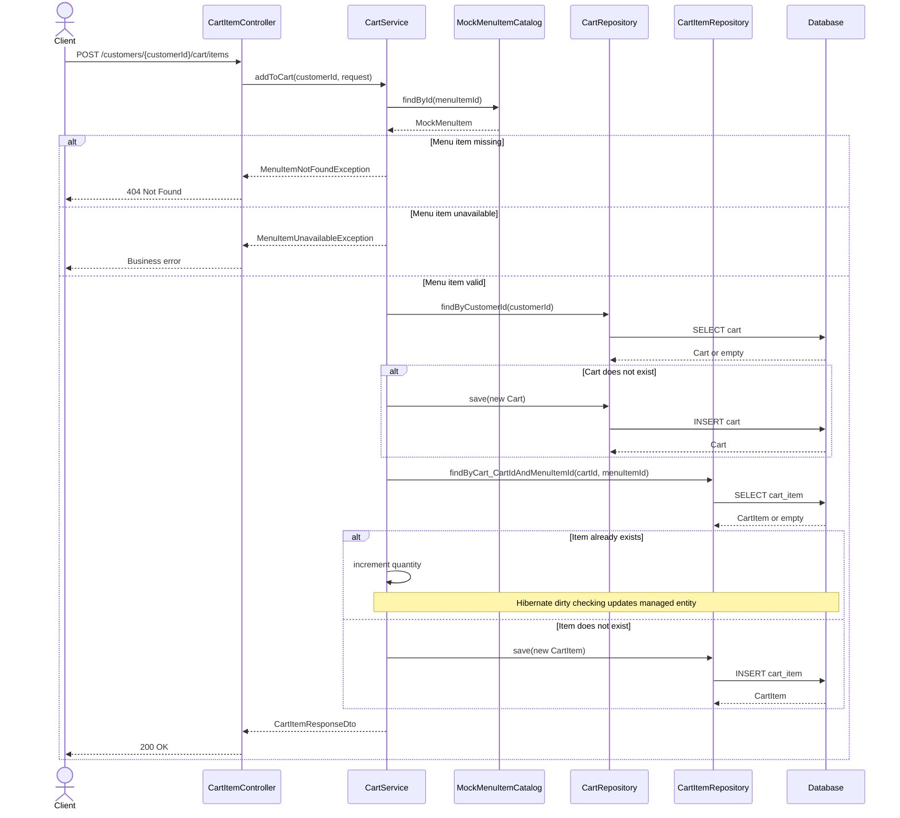

## Flowchart

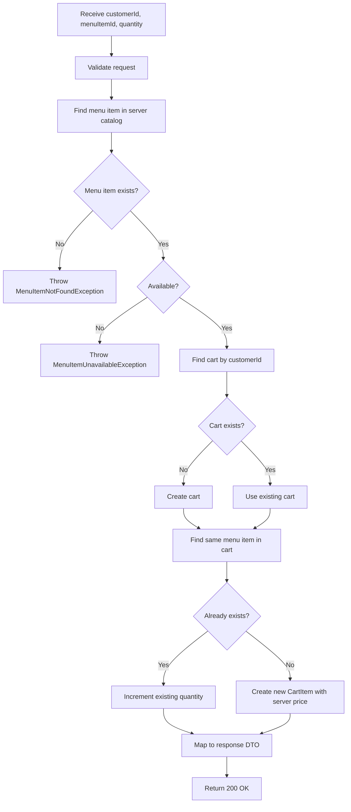

## Pseudocode

```text
FUNCTION addToCart(customerId, request):

    menuItem = menuCatalog.findById(request.menuItemId)

    IF menuItem does not exist:
        THROW MenuItemNotFoundException

    IF menuItem is unavailable:
        THROW MenuItemUnavailableException

    cart = cartRepository.findByCustomerId(customerId)

    IF cart does not exist:
        cart = new Cart(customerId)
        cartRepository.save(cart)

    existingItem =
        cartItemRepository.findByCart_CartIdAndMenuItemId(
            cart.cartId,
            menuItem.menuItemId
        )

    IF existingItem exists:
        existingItem.quantity =
            existingItem.quantity + request.quantity

        // No explicit save required when entity is managed
        result = existingItem

    ELSE:
        newItem = CartItem(
            cart = cart,
            menuItemId = menuItem.id,
            name = menuItem.name,
            quantity = request.quantity,
            price = menuItem.price
        )

        result = cartItemRepository.save(newItem)

    RETURN cartItemMapper.toResponseDto(result)
```

---

# 3. Update Cart Item Quantity

## Endpoint

```http
PATCH /api/v1/customers/{customerId}/cart/items/{cartItemId}
Content-Type: application/json
```

Request:

```json
{
  "quantity": 4
}
```

The `cartItemId` identifies the existing resource. The new quantity belongs in the request body.

Quantity must be greater than zero.

## Sequence Diagram

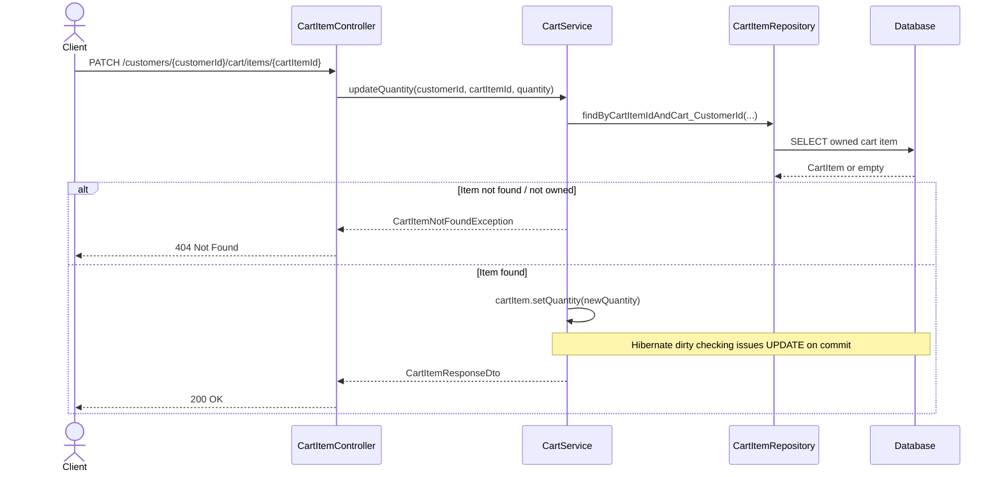

## Flowchart

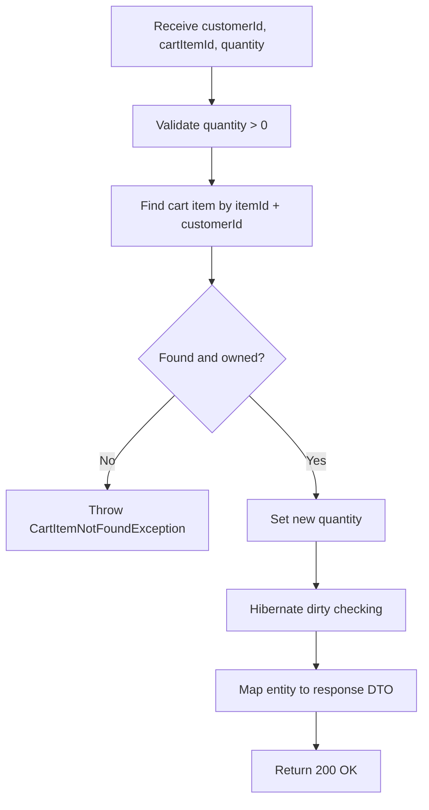

## Pseudocode

```text
FUNCTION updateQuantity(customerId, cartItemId, request):

    item =
        cartItemRepository.findByCartItemIdAndCart_CustomerId(
            cartItemId,
            customerId
        )

    IF item does not exist:
        THROW CartItemNotFoundException

    item.quantity = request.quantity

    // @Transactional keeps entity managed.
    // Hibernate persists the change using dirty checking.

    RETURN cartItemMapper.toResponseDto(item)
```

---

# 4. Remove Single Cart Item

## Endpoint

```http
DELETE /api/v1/customers/{customerId}/cart/items/{cartItemId}
```

Successful response:

```http
204 No Content
```

The delete query includes both `cartItemId` and `customerId` so the operation also enforces ownership.

## Repository concept

```java
@Modifying
@Query("""
    DELETE FROM CartItem ci
    WHERE ci.cartItemId = :cartItemId
      AND ci.cart.customerId = :customerId
""")
int deleteByCartItemIdAndCustomerId(
        UUID cartItemId,
        UUID customerId
);
```

`@Modifying` tells Spring Data that the JPQL query changes database state instead of reading data.

The returned `int` is the number of deleted rows.

## Sequence Diagram

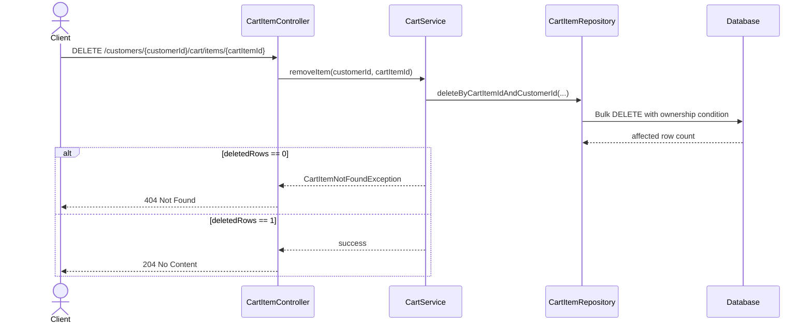

## Flowchart

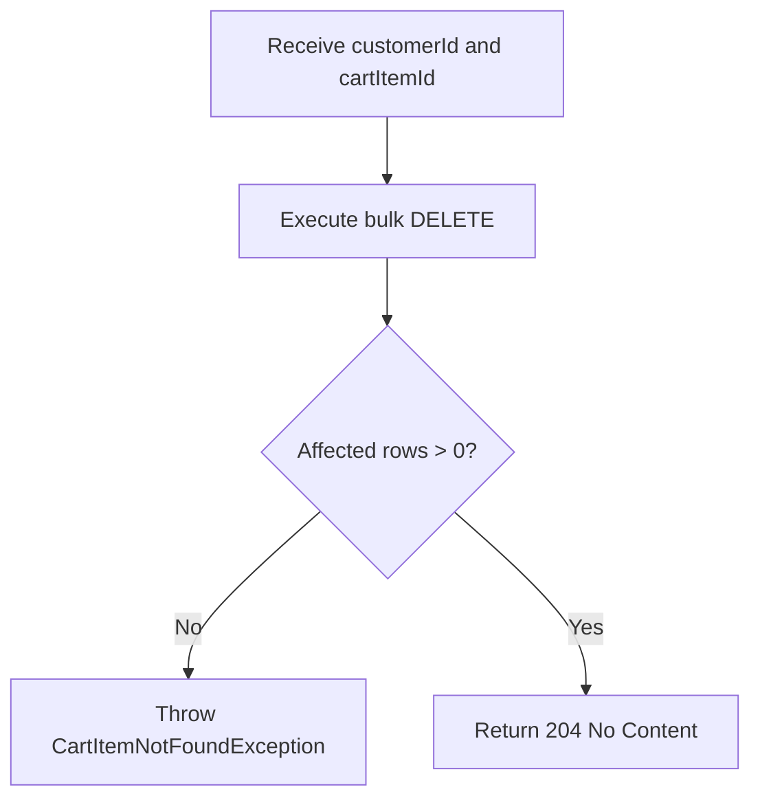

## Pseudocode

```text
FUNCTION removeItem(customerId, cartItemId):

    deletedRows =
        cartItemRepository.deleteByCartItemIdAndCustomerId(
            cartItemId,
            customerId
        )

    IF deletedRows == 0:
        THROW CartItemNotFoundException

    RETURN no content
```

---

# 5. Batch Remove Cart Items

## Endpoint

```http
POST /api/v1/customers/{customerId}/cart/items/batch-delete
Content-Type: application/json
```

Request:

```json
{
  "cartItemIds": [
    "0190f002-1111-7000-8000-000000000001",
    "0190f002-1111-7000-8000-000000000002",
    "0190f002-1111-7000-8000-000000000003"
  ]
}
```

This endpoint may also receive a single ID:

```json
{
  "cartItemIds": [
    "0190f002-1111-7000-8000-000000000001"
  ]
}
```

The database still executes a valid bulk `IN (...)` delete.

## Repository concept

```java
@Modifying
@Query("""
    DELETE FROM CartItem ci
    WHERE ci.cartItemId IN :cartItemIds
      AND ci.cart.customerId = :customerId
""")
int deleteCartItems(
        UUID customerId,
        Collection<UUID> cartItemIds
);
```

This is a **bulk delete**, not JDBC batching.

For 100 requested IDs, the goal is one SQL delete statement with an `IN` predicate rather than 100 individual `DELETE` statements.

## Sequence Diagram

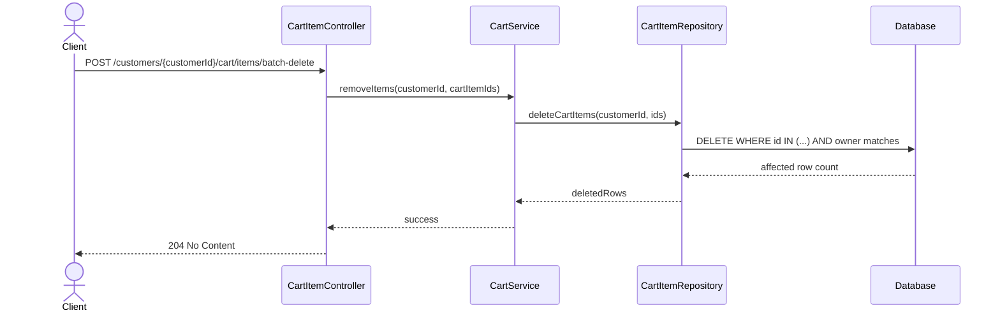

## Flowchart

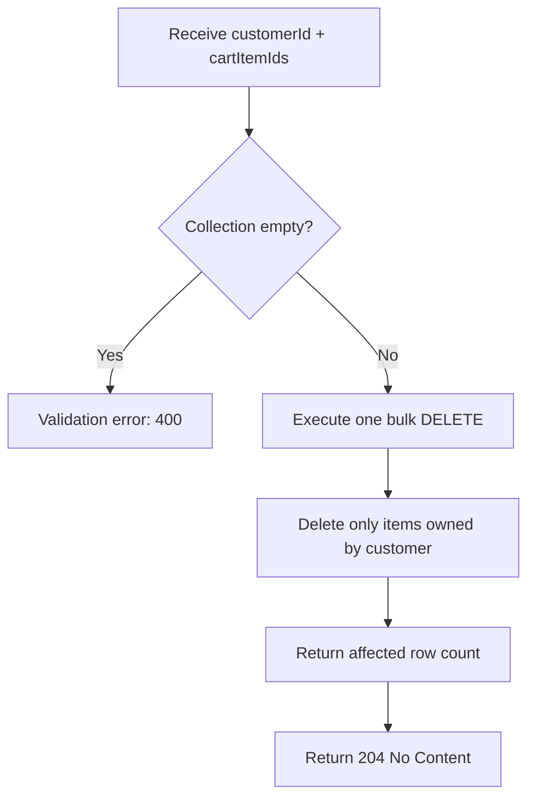

## Pseudocode

```text
FUNCTION removeItems(customerId, request):

    IF request.cartItemIds is empty:
        RETURN validation error

    deletedRows =
        cartItemRepository.deleteCartItems(
            customerId,
            request.cartItemIds
        )

    // Foreign-owned or nonexistent IDs are not deleted.
    // Avoid exposing whether another customer's ID exists.

    RETURN no content
```

### Why not `deleteAllByIdInBatch(...)`?

`deleteAllByIdInBatch(ids)` can bulk-delete IDs, but it does not naturally include the ownership requirement:

```text
cartItemId IN (...)
AND cart.customerId = customerId
```

The custom bulk query performs identification, ownership filtering, and deletion in one database operation.

---

# 6. Clear Cart

## Endpoint

```http
DELETE /api/v1/customers/{customerId}/cart
```

Successful response:

```http
204 No Content
```

Clearing a cart means:

```text
Delete all CartItem rows belonging to the cart.
Keep the Cart itself.
```

It does **not** delete the `Cart` record.

The operation is intentionally idempotent:

- Cart contains items -> delete them -> success.
- Cart is already empty -> success.
- No matching items -> success.

## Repository concept

```java
@Modifying
@Query("""
    DELETE FROM CartItem ci
    WHERE ci.cart.customerId = :customerId
""")
int deleteAllByCustomerId(UUID customerId);
```

## Sequence Diagram

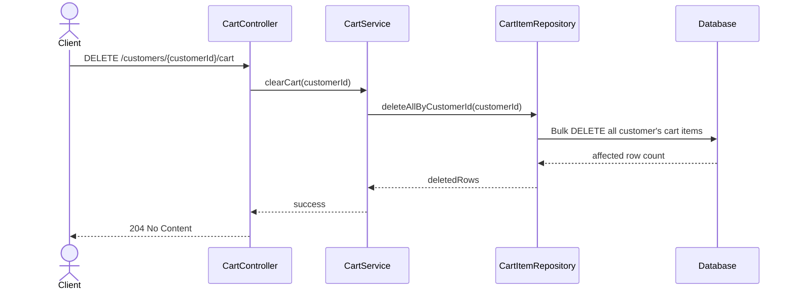

## Flowchart

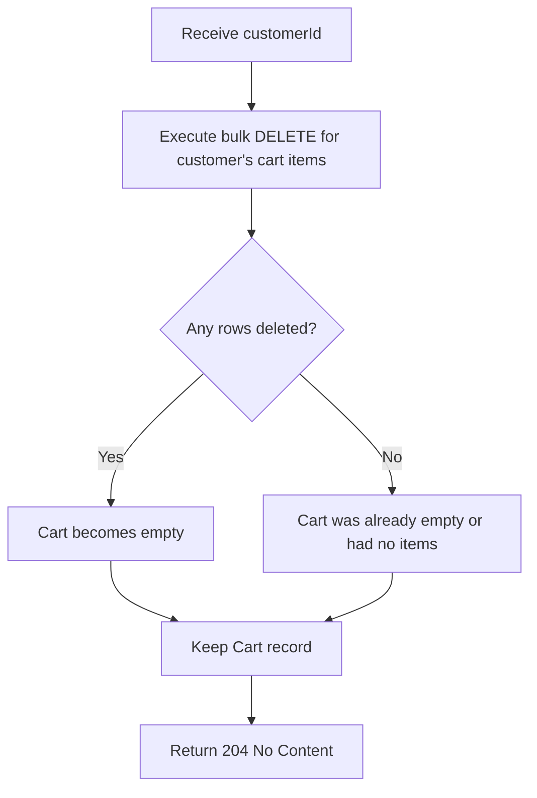

## Pseudocode

```text
FUNCTION clearCart(customerId):

    cartItemRepository.deleteAllByCustomerId(customerId)

    // No error when zero rows are deleted.
    // Desired final state is simply: cart contains no items.

    RETURN no content
```

---

# Validation and Error Handling

Request DTO validation uses Jakarta Bean Validation.

Example:

```java
@NotNull(message = "Quantity is required")
@Positive(message = "Quantity must be greater than zero")
Integer quantity;
```

A global validation handler can collect field errors:

```java
@ExceptionHandler(MethodArgumentNotValidException.class)
public ResponseEntity<ErrorResponse> handleValidationException(
        MethodArgumentNotValidException ex) {

    String errors = ex.getBindingResult()
            .getFieldErrors()
            .stream()
            .map(error ->
                    error.getField() + ": " + error.getDefaultMessage()
            )
            .collect(Collectors.joining(", "));

    ErrorResponse response = ErrorResponse.builder()
            .status(HttpStatus.BAD_REQUEST.name())
            .message(errors)
            .timestamp(LocalDateTime.now())
            .build();

    return ResponseEntity
            .status(HttpStatus.BAD_REQUEST)
            .body(response);
}
```

Generic internal server errors should not expose internal implementation details:

```java
@ExceptionHandler(Exception.class)
public ResponseEntity<ErrorResponse> handleInternalServerError(
        Exception ex) {

    log.error("Unhandled exception occurred", ex);

    ErrorResponse response = ErrorResponse.builder()
            .status(HttpStatus.INTERNAL_SERVER_ERROR.name())
            .message("An unexpected error occurred")
            .timestamp(LocalDateTime.now())
            .build();

    return ResponseEntity
            .status(HttpStatus.INTERNAL_SERVER_ERROR)
            .body(response);
}
```

Recommended error mapping:

| Condition | HTTP |
|---|---|
| Invalid request body | `400 Bad Request` |
| Cart item not found / not owned | `404 Not Found` |
| Menu item not found | `404 Not Found` |
| Menu item unavailable | `409 Conflict` or domain-specific `400` |
| Unexpected server error | `500 Internal Server Error` |

---

# Persistence Notes

## `@Modifying`

Spring Data assumes an `@Query` is a read query unless told otherwise.

For JPQL `UPDATE` or `DELETE` queries:

```java
@Modifying
@Query("DELETE ...")
```

`@Modifying` tells Spring Data:

```text
This query changes persistent state.
Execute it as an update/delete operation.
```

Bulk JPQL updates/deletes bypass normal per-entity state transitions.

When mixing bulk operations with already-managed entities in the same persistence context, consider:

```java
@Modifying(
    flushAutomatically = true,
    clearAutomatically = true
)
```

when appropriate.

---

## Transaction Boundary

Business write operations should normally be transactional at the service layer:

```java
@Transactional
public void removeItem(...) {
    ...
}
```

```java
@Transactional
public void clearCart(...) {
    ...
}
```

```java
@Transactional
public CartItemResponseDto updateQuantity(...) {
    ...
}
```

This keeps the transaction aligned with the business operation rather than individual repository calls.

---

## Hibernate Dirty Checking

For an entity loaded within an active transaction:

```java
CartItem item = repository.findById(...).orElseThrow();

item.setCartItemQuantity(4);
```

an explicit:

```java
repository.save(item);
```

is generally unnecessary.

Hibernate tracks the managed entity and issues the required `UPDATE` when the persistence context flushes.

New entities still require persistence:

```java
repository.save(newCartItem);
```

---

## Identifier Generation

`@ColumnDefault("uuidv7()")` alone is **not** a JPA identifier generator.

This mapping:

```java
@Id
@ColumnDefault("uuidv7()")
private UUID cartItemId;
```

can still cause:

```text
Identifier must be manually assigned before calling persist()
```

Use a consistent identifier-generation strategy for `Cart`, `CartItem`, and future domain entities.

If UUIDv7 is required, generate it consistently in the application or configure an appropriate supported generator rather than relying only on `@ColumnDefault`.

---

## Relationship Mapping

Recommended relationship:

```java
@Entity
public class Cart {

    @OneToMany(
        mappedBy = "cart",
        fetch = FetchType.LAZY,
        cascade = CascadeType.ALL,
        orphanRemoval = true
    )
    private List<CartItem> items = new ArrayList<>();
}
```

```java
@Entity
public class CartItem {

    @ManyToOne(fetch = FetchType.LAZY)
    @JoinColumn(name = "cart_id", nullable = false)
    private Cart cart;
}
```

`CartItem` owns the relational foreign key because `cart_item.cart_id` is physically stored in the child table.

The `Cart.items` collection is useful for aggregate navigation, but targeted repository queries and bulk operations should still be used where they are more efficient.

---

# Future Authentication Refactor

Current API:

```text
GET    /customers/{customerId}/cart
DELETE /customers/{customerId}/cart

POST   /customers/{customerId}/cart/items
PATCH  /customers/{customerId}/cart/items/{cartItemId}
DELETE /customers/{customerId}/cart/items/{cartItemId}

POST   /customers/{customerId}/cart/items/batch-delete
```

After JWT/Spring Security is implemented:

```text
GET    /cart
DELETE /cart

POST   /cart/items
PATCH  /cart/items/{cartItemId}
DELETE /cart/items/{cartItemId}

POST   /cart/items/batch-delete
```

The customer identity should then come from:

```text
JWT
 ↓
SecurityContext
 ↓
Authenticated Principal
 ↓
customerId
 ↓
CartService
```

The service contract can remain largely unchanged:

```java
cartService.addToCart(customerId, request);
cartService.updateQuantity(customerId, cartItemId, request);
cartService.removeItem(customerId, cartItemId);
cartService.removeItems(customerId, request);
cartService.clearCart(customerId);
```

Only the source of `customerId` changes.

---

# Summary

The cart API follows these core design decisions:

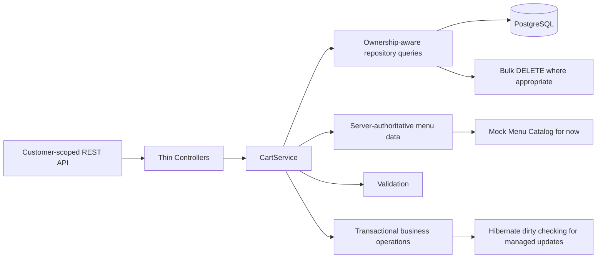

The most important rules are:

- Keep `customerId` in the path only until authentication is available.
- Never trust client-supplied price.
- Use `cartItemId` in the path when addressing an existing item.
- Keep quantity changes explicit with `PATCH`.
- Keep removal explicit with `DELETE`.
- Use one bulk database delete for batch removal and clear-cart operations.
- Enforce ownership inside repository predicates where practical.
- Keep `Cart` as the aggregate-level business concept even when controllers are separated.