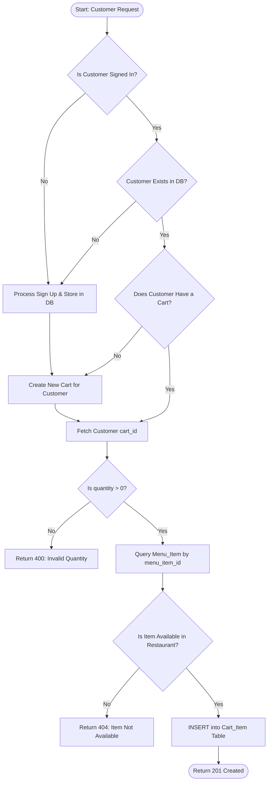
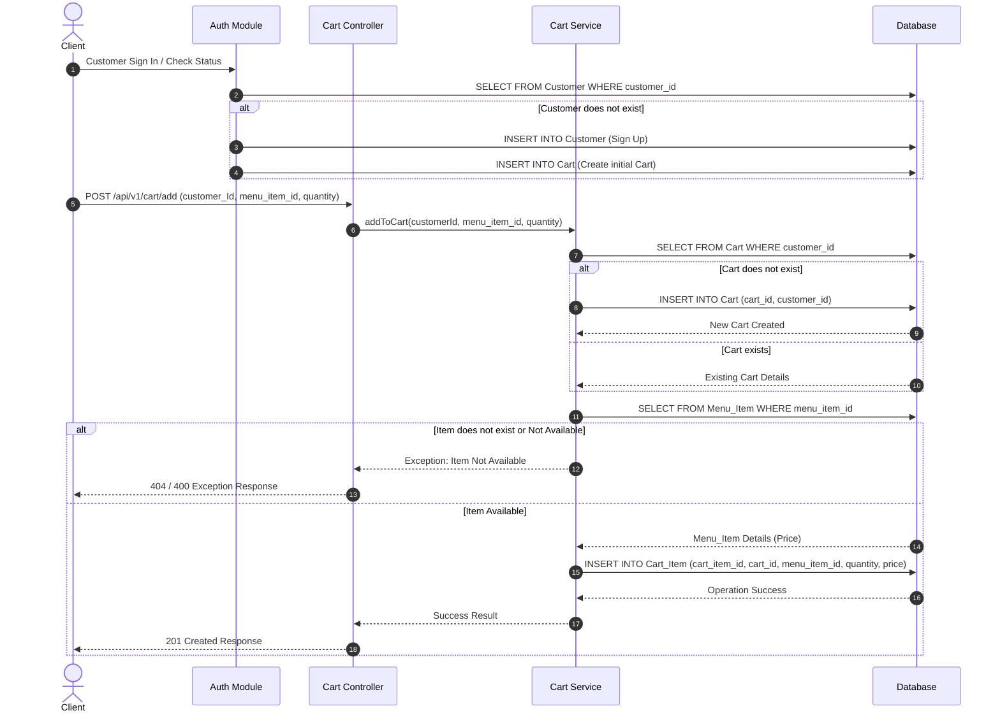
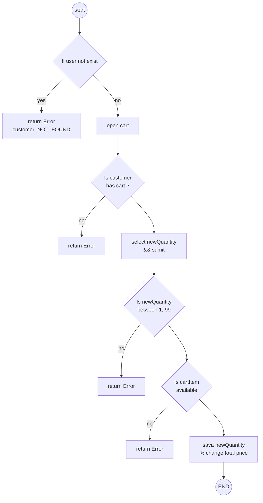
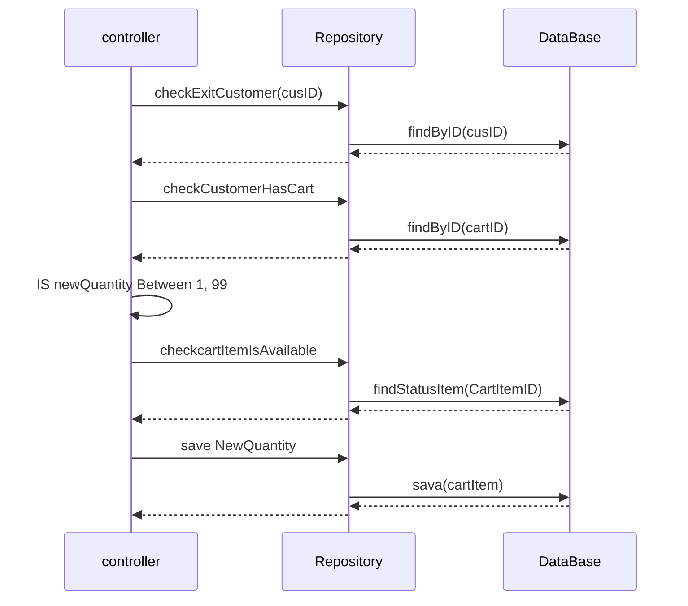
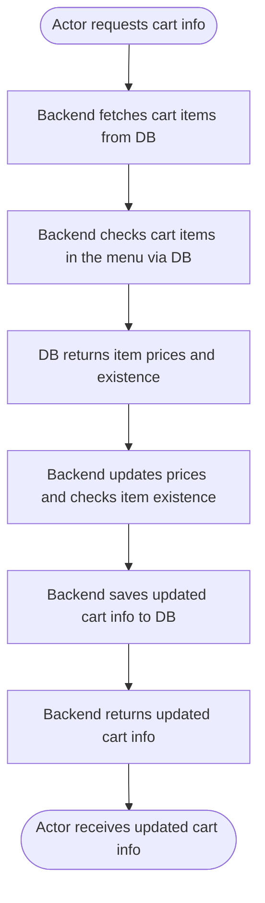
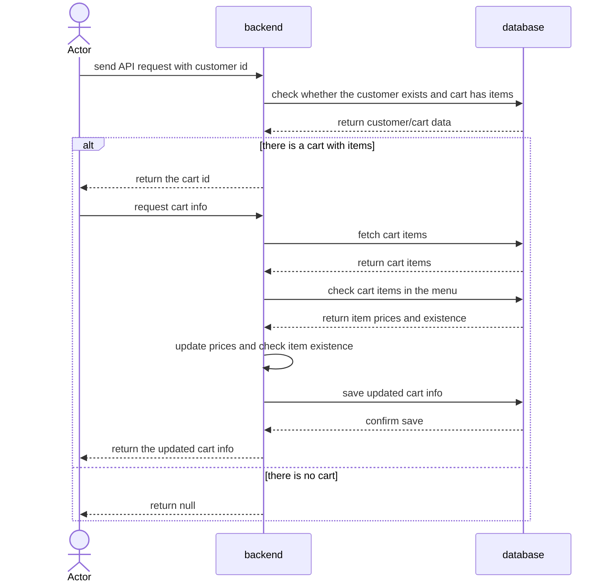
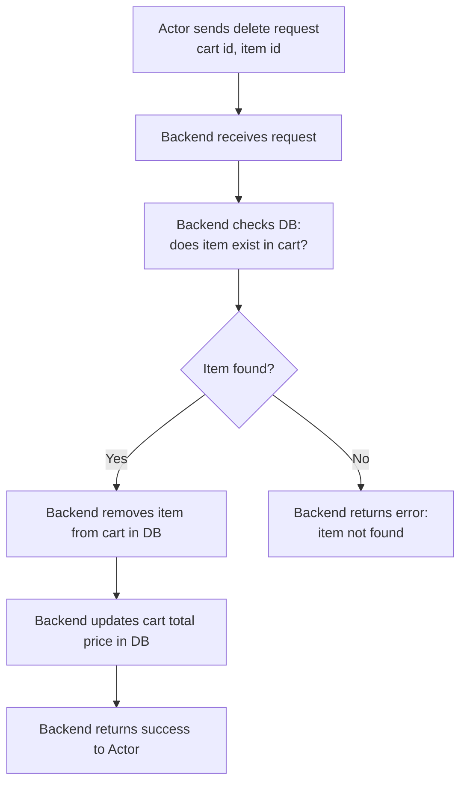
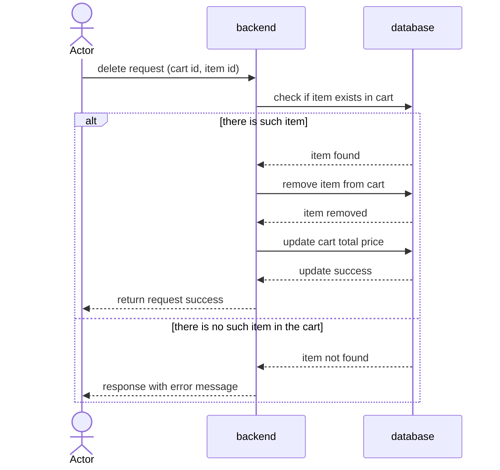

# food_delivery_api

for java eats lite documentation.

This document contains the core software specifications, architecture flows, diagrams, and backend pseudo-code for the Java eats Lite modules.

---

## Cart Management Module

---

### 1. Add to Cart Feature Specification

The Add to Cart feature allows customers to append items to their active shopping cart upon verifying authentication, cart existence, and item availability in the restaurant's menu.

#### A. API Endpoint Specification

* **Signature (URL):** `/api/v1/cart/add`
* **HTTP Method:** `POST`
* **Success Status Code:** `201 Created`

#### Request Body Input
```json
{
  "customerId": "cust_99",
  "menu_item_id": "item_123",
  "quantity": 2
}
```

#### Success Response Body (201 Created)
```json
{
  "status": "success",
  "message": "Item added to cart successfully"
}
```

#### Error Response Body (404 Not Found)
```json
{
  "status": "error",
  "message": "Item Not Available"
}
```

---

### B. Feature Architecture & Workflows

#### |. Process Flowchart



#### ||. Sequence Diagram



---
### C. Backend Implementation Logic

#### Pseudo Code

```text
FUNCTION addToCart(customerId, menu_item_id, quantity):

    // 1. Customer Authentication & Existence Check
    user = Database.find("Customer", WHERE customer_id == customerId)
    IF user IS NULL THEN
        Customer = signUpCustomer(customerId)
    END IF

    // 2. Ensure Customer Has an Active Cart
    cart = Database.find("Cart", WHERE customer_id == customerId)
    IF cart IS NULL THEN
        cart = NEW Cart()
        cart.cart_id = GENERATE_UUID()
        cart.customer_id = customerId
        Database.save(cart)
    END IF

    // 3. Input Validation
    IF quantity <= 0 THEN
        RETURN Response(statusCode=400, message="Quantity must be greater than zero")
    END IF

    // 4. Validate Menu Item Existence & Availability
    menuItem = Database.find("Menu_Item", WHERE menu_item_id == menu_item_id)
    IF menuItem IS NULL OR menuItem.is_available == FALSE THEN
        THROW EXCEPTION "Item Not Available"
        RETURN Response(statusCode=404, message="Item is not available in the restaurant")
    END IF

    // 5. Direct Insertion into Cart_Item
    newCartItem = NEW Cart_Item()
    newCartItem.cart_item_id = GENERATE_UUID()
    newCartItem.cart_id = cart.cart_id
    newCartItem.menu_item_id = menu_item_id
    newCartItem.cart_item_quantity = quantity
    newCartItem.cart_item_price = menuItem.menu_item_price
    
    Database.save(newCartItem)

    // 6. Return Success Response
    RETURN Response(statusCode=201, message="Item added to cart successfully")

END FUNCTION
```

---

## 2. Update Quantity

### A. Flow Chart Update


### B. Sequence Diagram Update Quantity



### C. Request Body Update Quantity


### D. Pseudo Code Update Quantity
```text
START

    Is user exist?

    IF customer does not exist
        RETURN Error
    END IF

    Is customer has cart?

    IF customer does not have cart
        RETURN Error

    // update quantity

    If newQuantity is unavailable in menu
        not change quantity
    END IF

    IF newQuantity > 1 && newQuantity < 99
        update quantity
        Change total price
    END IF

    sava change in Db
```

### 1. View Cart Flowchart ([view_cart_flowchart.mmd])



---

### 2. Show Cart Sequence Diagram & Pseudocode ([show_cart_sequence.mmd])

#### Sequence Diagram


#### Pseudocode
```


FUNCTION handleCartRequest(customerId):

    customerData = DB.checkCustomerAndCart(customerId)

    IF customerData.cartExists AND customerData.cartHasItems THEN

        RETURN cartId TO actor

        # ---- second call: actor requests full cart info ----
        FUNCTION handleCartInfoRequest(cartId):

            cartItems = DB.fetchCartItems(cartId)

            FOR EACH item IN cartItems:
                menuResult = DB.checkItemInMenu(item.id)

                IF menuResult.exists THEN
                    item.price = menuResult.price
                ELSE
                    item.markAsUnavailable()
                END IF
            END FOR

            DB.saveUpdatedCart(cartId, cartItems)

            RETURN updatedCartInfo TO actor

    ELSE
        RETURN null TO actor
    END IF

END FUNCTION

```

---

### 3. Remove Cart Flowchart ([remove_cart_flowchart.mmd])



---

### 4. Delete Cart Sequence Diagram & Pseudocode ([delete_cart_sequence.mmd])

#### Sequence Diagram


#### Pseudocode
```
FUNCTION deleteItemFromCart(cartId, itemId):

    RECEIVE delete request from Actor with cartId and itemId

    item = DB.findItemInCart(cartId, itemId)

    IF item EXISTS:
        DB.removeItemFromCart(cartId, itemId)
        DB.updateCartTotalPrice(cartId)
        RETURN success response to Actor
    ELSE:
        RETURN error response "item not found in cart" to Actor

    END FUNCTION
```

view cart
-get signature /api/v1/cart
-input customer id
-output status code [200] cart info

delete item
 -delete signature /api/v1/cart
 -input cart-id with item-id
 -output status[200] return total price
