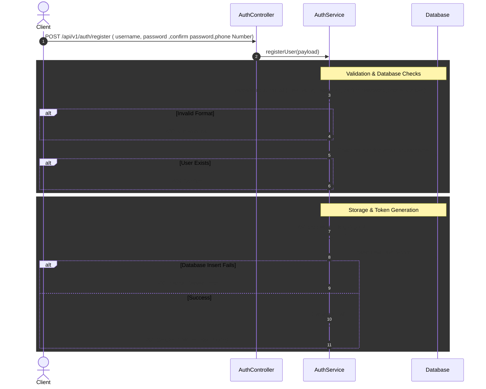
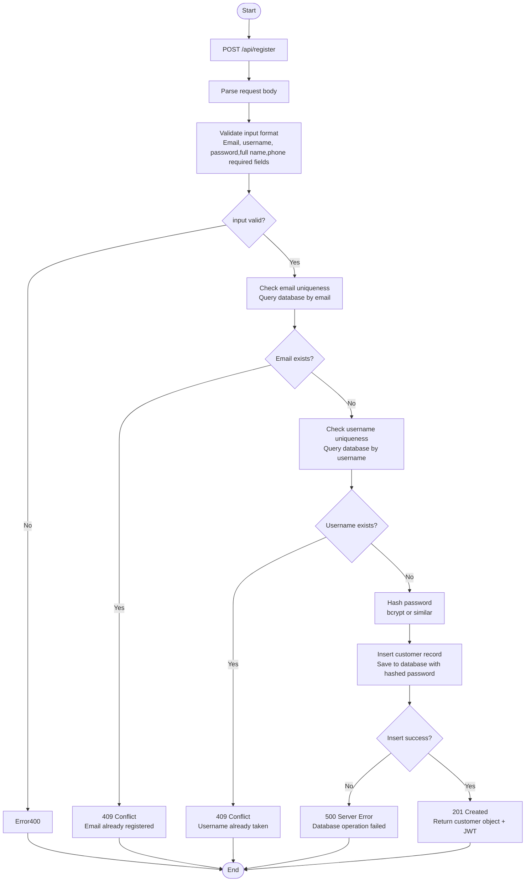

# sequenceDiagram



# flowchart

# peducode 


```
FUNCTION handleUserRegistration(httpRequest):
    TRY:
        // ====================================================
        // STEP 1: RECEIVE & PARSE REQUEST
        // ====================================================
        payload = httpRequest.body
        email = payload.email
        username = payload.username
        password = payload.password
        fullName = payload.fullName
        phone = payload.phone

        // ====================================================
        // STEP 2: FORMAT VALIDATION (Client Error 400)
        // ====================================================
        // Check required fields, email format, and username constraints
        IF email IS NULL OR username IS NULL OR password IS NULL OR fullName IS NULL OR phone IS NULL:
            RETURN Response(status = 400, body = { "error": "Missing required fields" })

        IF NOT isValidEmailFormat(email):
            RETURN Response(status = 400, body = { "error": "Invalid email address format" })

        IF LENGTH(username) < 3 OR LENGTH(username) > 30 OR NOT isAlphanumericWithUnderscore(username):
            RETURN Response(status = 400, body = { "error": "Username must be 3-30 characters, no spaces, letters/numbers/underscores only" })

        IF LENGTH(password) < 8:
            RETURN Response(status = 400, body = { "error": "Password must be at least 8 characters long" })
        
        IF fullName IS EMPTY:
            RETURN Response(status = 400, body = { "error": "full name is required" })

        IF NOT matchesRegex(phone, "^\\+?[0-9]{7,15}$"):
            RETURN Response(status = 400, body = { "error": "Phone must contain 7-15 digits and may start with +" })


        // ====================================================
        // STEP 3: DATABASE UNIQUENESS CHECK (Client Error 409)
        // ====================================================
        existingUser = Database.findUserByEmailOrUsername(email, username)

        IF existingUser EXISTS:
            IF existingUser.email == email:
                RETURN Response(status = 409, body = { "error": "Email already registered" })
            IF existingUser.username == username:
                RETURN Response(status = 409, body = { "error": "Username already taken" })


        // ====================================================
        // STEP 4: PASSWORD HASHING
        // ====================================================
        hashedPassword = Argon2.hash(password)


        // ====================================================
        // STEP 5: PERSIST USER (Server Error 500)
        // ====================================================
        TRY:
            newUser = Database.insertUser({
                "email": email,
                "username": username,
                "passwordHash": hashedPassword,
                "createdAt": getCurrentTimestamp()
            })
        CATCH DatabaseException AS dbErr:
            RETURN Response(status = 500, body = { "error": "Failed to create user record due to a database error" })


        // ====================================================
        // STEP 6: TOKEN GENERATION & SUCCESS RESPONSE (201)
        // ====================================================
        jwtToken = JWT.generateToken({
            "userId": newUser.id,
            "email": newUser.email
        })

        userProfile = {
            "id": newUser.id,
            "username": newUser.username,
            "email": newUser.email,
            
        }

        RETURN Response(
            status = 201,
            body = {
                "token": jwtToken,
                "user": userProfile
            }
        )

    CATCH UnexpectedException AS err:
        RETURN Response(status = 500, body = { "error": "An unexpected error occurred" })
```

## Registration API Endpoint

### Request

```http
POST /api/v1/auth/register
Content-Type: application/json
```

```json
{
    "email": "sam@example.com",
    "username": "sam_delivery",
    "password": "SecurePass123!",
    "fullName": "Sam Carter",
    "phone": "+14155552671"
}
```

### Response Cases

#### Case 1: Registration successful

**Status:** `201 Created`

```json
{
    "token": "eyJhbGciOiJIUzI1NiIsInR5cCI6IkpXVCJ9..."
    
    }
}
```

#### Case 2: Invalid request data

**Status:** `400 Bad Request`

```json
{
    "error": "Phone must contain 7-15 digits and may start with +"
}
```

#### Case 3: Email already registered

**Status:** `409 Conflict`

```json
{
    "error": "Email already registered"
}
```

#### Case 4: Username already taken

**Status:** `409 Conflict`

```json
{
    "error": "Username already taken"
}
```

#### Case 5: Database or unexpected server error

**Status:** `500 Internal Server Error`

```json
{
    "error": "An unexpected error occurred"
}
```